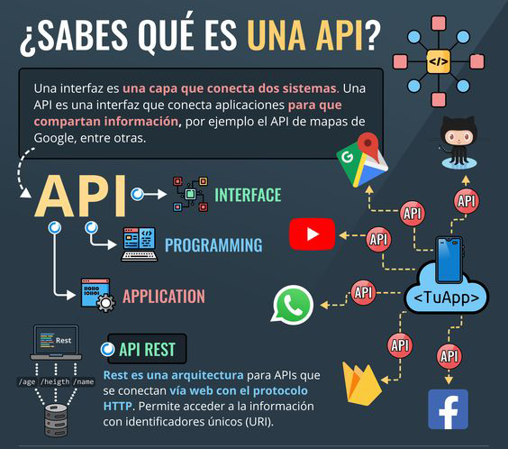
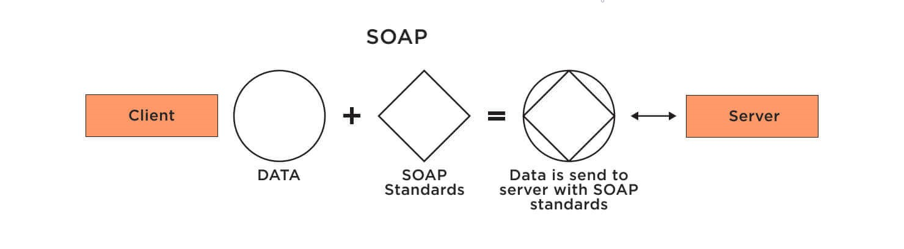
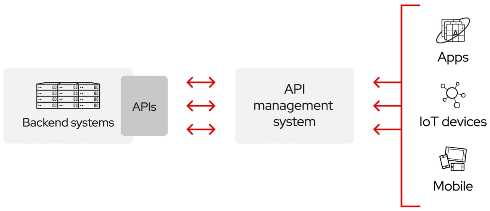

# [[Módulo 1] Introducción](https://www.redhat.com/es/topics/integration/whats-the-difference-between-soap-rest)

## Que es API?

Una API es un conjunto de definiciones y protocolos que se utiliza para desarrollar e integrar el software de las aplicaciones. API significa interfaz de programación de aplicaciones.
Estas permiten que sus productos y servicios se comuniquen con otros, sin necesidad de saber cómo están implementados. Esto simplifica el desarrollo de las aplicaciones y permite ahorrar tiempo y dinero. Ademas estas le otorgan flexibilidad; simplifican el diseño, la administración y el uso de las aplicaciones, y proporcionan oportunidades de innovación, lo cual es ideal al momento de diseñar herramientas y productos nuevos (o de gestionar los actuales).

en pocas palabras API son un medio simplificado para conectar su propia infraestructura a través del desarrollo de aplicaciones nativas de la nube, pero también le permiten compartir sus datos con clientes y otros usuarios externos. Las API públicas representan un valor comercial único porque simplifican y amplían la forma en que se conecta con sus partners y, además, pueden rentabilizar sus datos (un ejemplo conocido es la API de Google Maps).

 

## Que es REST?

REST es un conjunto de principios arquitectónicos que se ajusta a las necesidades de los servicios web y las aplicaciones móviles ligeros. Dado que se trata de un conjunto de pautas, la implementación de las recomendaciones depende de los desarrolladores.

Cuando se envía una solicitud de datos a una API de REST, se suele hacer a través de un protocolo de transferencia de hipertexto, comúnmente denominado HTTP. Una vez que reciben la solicitud, las API diseñadas para REST (conocidas como API o servicios web de RESTful) pueden devolver mensajes en distintos formatos: HTML, XML, texto sin formato y JSON. El formato preferido para los mensajes es la notación de objetos JavaScript (JSON), ya que, a pesar de su nombre, puede leerlo cualquier lenguaje de programación, es ligero y lo comprenden tanto las personas como las máquinas. De esta forma, las API de RESTful son más flexibles y se pueden configurar con mayor facilidad.

 

## Que es SOAP?

SOAP es un protocolo estándar que se creó originalmente para permitir la comunicación entre las aplicaciones que se diseñaban con diferentes lenguajes y en diferentes plataformas. Como es un protocolo, impone reglas integradas que aumentan la complejidad y la sobrecarga, lo cual puede retrasar el tiempo que tardan las páginas en cargarse.

Las especificaciones comunes de los servicios web incluyen lo siguiente:

- Seguridad de los servicios web (WS-Security): estandariza la forma de proteger y transferir los mensajes usando identificadores únicos llamados tokens.
- Mensajería segura de los servicios web (WS-ReliableMessaging): estandariza el control de errores entre mensajes que se transfieren en infraestructuras de TI poco confiables.
- Abordaje de los servicios web (WS-Addressing): paquetes que enrutan la información como metadatos dentro de los encabezados SOAP, en lugar de mantener la información en un lugar más profundo de la red.
- Lenguaje de descripción de los servicios web (WSDL): describe qué hace un servicio web, así como dónde comienza y termina.

El envío de una solicitud de datos a una API de SOAP se puede administrar a través de cualquiera de los protocolos de la capa de la aplicación: HTTP (para los exploradores web), SMTP (para el correo electrónico), TCP, entre otros. Sin embargo, una vez que se recibe una solicitud, los mensajes SOAP de retorno deben ser documentos XML, que es un lenguaje de marcado que comprenden las personas y las máquinas. Una solicitud completa a una API de SOAP no se almacena en caché por un navegador, por lo que no se puede acceder a ella después sin reenviarla a la API.

 

## REST VS SOAP?

Es posible que muchos sistemas heredados sigan rigiéndose por SOAP, aunque REST haya surgido más tarde y se considere una alternativa más rápida en los escenarios basados en la Web. REST es un conjunto de pautas que ofrece una implementación flexible, mientras que SOAP es un protocolo con requisitos específicos, como en el caso de la mensajería XML.

Las API de REST son ligeras, así que son ideales para los contextos más nuevos, como el Internet de las cosas (IoT), el desarrollo de aplicaciones móviles y la informática sin servidor. Los servicios web de SOAP ofrecen seguridad y cumplimiento de las operaciones integrados que coinciden con muchas de las necesidades empresariales, pero que también los hacen más pesados. Asimismo, muchas API públicas, como la API de Google Maps, siguen las pautas de REST.

 

## Que es API Connect ?

IBM API Connect es una solución de gestión de APIs que permite crear, ejecutar, gestionar y proteger APIs y microservicios.
Esta plataforma nos permite conectar clientes finales a un servidor de una empresa para consumir ciertos productos, además esta nos permite controlar que clientes se puede conectar y a que recursos, es decir, da una capa de seguridad y de filtrado haciendo la conexión del servidor de dicha empresa mucho más flexible mediante diversos métodos de seguridad que ofrece la plataforma.
en poca palabras API Connect nos permite exponer servicios tanto REST como SOAP.

 

## Referencias⚙️

- [API "Application Programming Interface"](https://www.redhat.com/es/topics/api/what-are-application-programming-interfaces)
- [REST / SOAP](https://www.redhat.com/es/topics/integration/whats-the-difference-between-soap-rest)
- [IBM API Connect](https://www.ibm.com/cl-es/cloud/api-connect)
