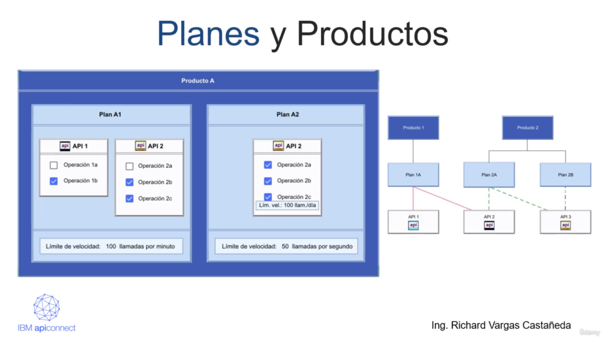
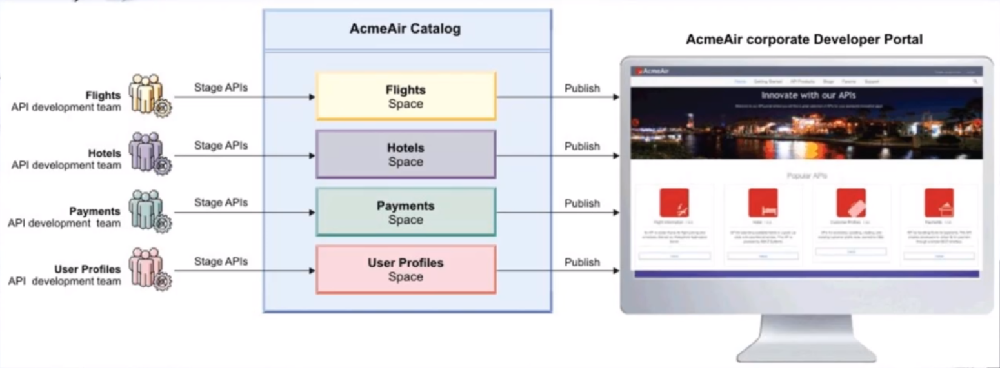
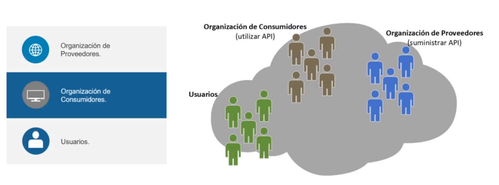

# [[Módulo 2] IBM API Connect](https://www.ibm.com/docs/es/api-connect/10.0.x)

## Planes y Productos

Los planes y productos son artefactos de empaquetados. estos tienen reglas dentro de los cuales un plan solo puede tener un producto y un producto puede tener varios planes que contiene un conjunto de APIs Diferentes. un plan de un producto puede compartir las API con otros planes de cualquier otro producto.

## Catálogos y Espacios

Los catálogos son los encargados de contener una colección de productos, estos catálogos se usan para separar los productos y las APIs de dicho producto a efectos de pruebas. Un proveedor de API usa un catalogo de desarrollo y un catálogo de producción para publicar las APIs que se encuentren listas.

Los espacios le permiten administrar los Productos y sus APIs que son específicos de ese Espacio de forma que pueda controlar el acceso a un grupo de usuario específicos.

 

## Organizaciones, Usuarios y Aplicaciones

Existen dos tipos de organizaciones, la de proveedores y la de consumidores y/o desarrolladores.
La org de proveedores posee sus propios planes, productos y APIs asociados y la org de consumidores posee aplicaciones de desarrollador y consume las APIs producidas por la org de proveedores.
En cuanto a los usuarios estos pueden ser miembros de una organización de proveedores o consumidores.
Por último, la org de proveedores puede crear aplicaciones compiladas con Nodejs o Java que cuando se publican las aplicaciones de desarrollador pueden invocar dichas APIs y aplicaciones.

 

## Referencias⚙️

- [Planes](https://www.ibm.com/docs/en/acfc?topic=designer-defining-plan)
- [Productos](https://www.ibm.com/docs/en/api-connect/10.0.x?topic=applications-working-products)
- [Catálogos](https://www.ibm.com/docs/es/api-connect/10.0.x?topic=apis-working-catalogs)
- [Espacios](https://www.ibm.com/docs/en/api-connect/10.0.1.x?topic=connect-working-spaces)
- [Organizaciones y Usuarios](https://www.ibm.com/docs/es/api-connect/10.0.1.x?topic=concepts-who-does-what-in-api-connect)
