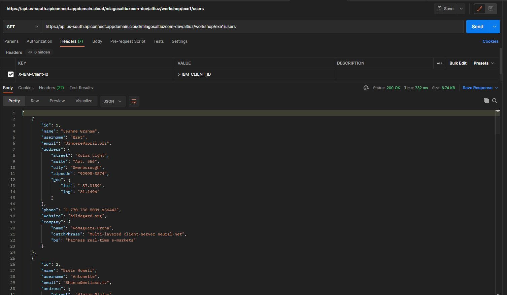
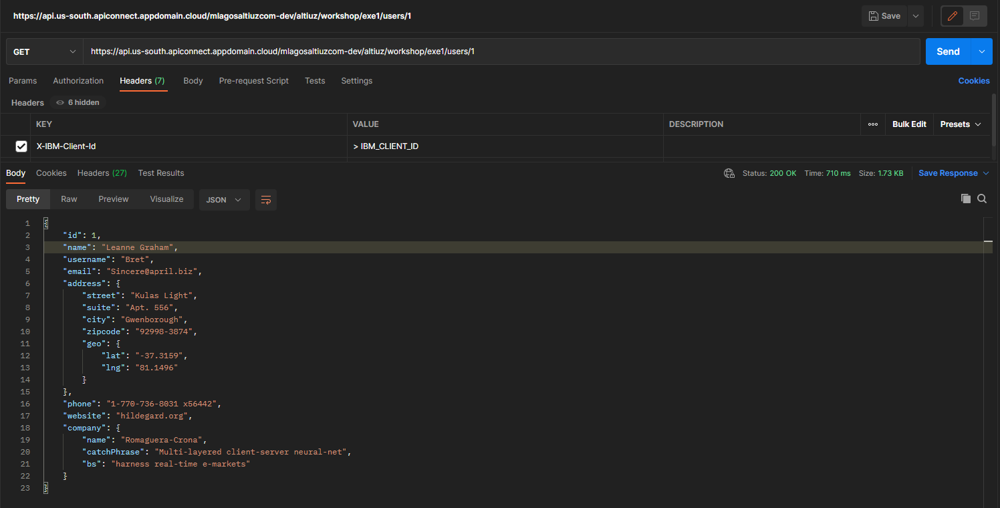

# [[Módulo 3] Ejercicio 1: REST](https://www.ibm.com/docs/en/api-connect/5.0.x?topic=endpoint-tutorial-creating-invoke-rest-api-definition)

## Objetivos

```
> Capturar y filtrar por ID la lista de usuarios del siguiente endpoint: https://jsonplaceholder.typicode.com/users
```

## Requerimientos

☐ Consumir URL Backend : https://jsonplaceholder.typicode.com/users <br/>
☐ Usar Propiedades de URL <br/>
☐ Usar ClientId API Key [ X-IBM-Client-Id ] <br/>
☐ URL de exposicion: <br/>
- operation : GET
- basepath: /workshop/exe1
- path: /users
- path: /users/{id}
## Resultado Esperados

<div align="center"></div> 

## Referencias⚙️
- [Create, deploy and test a new API using the IBM API Connect Developer Toolkit](https://ibm.github.io/cloudpakforintegration-workshop/exercise-api-connect/)
- [Creating Invoke REST API](https://www.ibm.com/docs/en/api-connect/5.0.x?topic=endpoint-tutorial-creating-invoke-rest-api-definition)
- [JSONPlaceHolder](https://jsonplaceholder.typicode.com)
