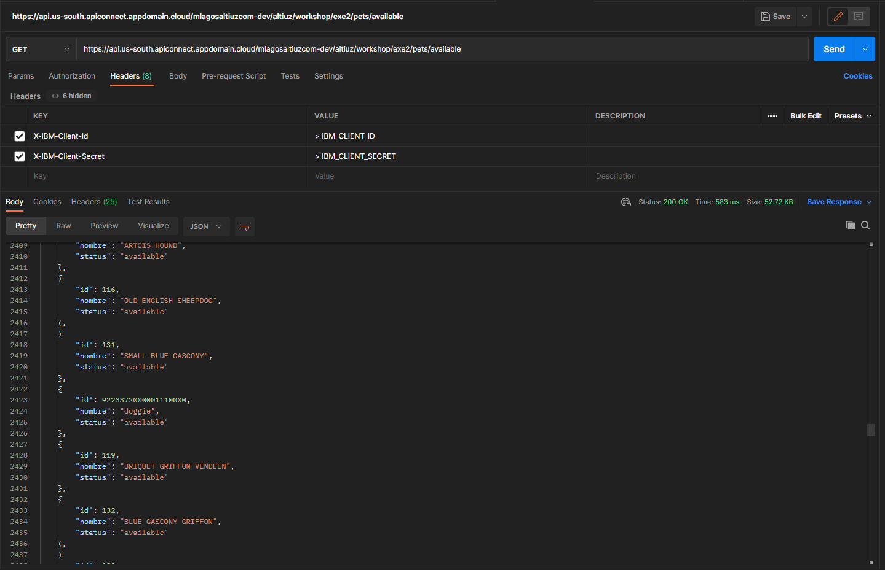
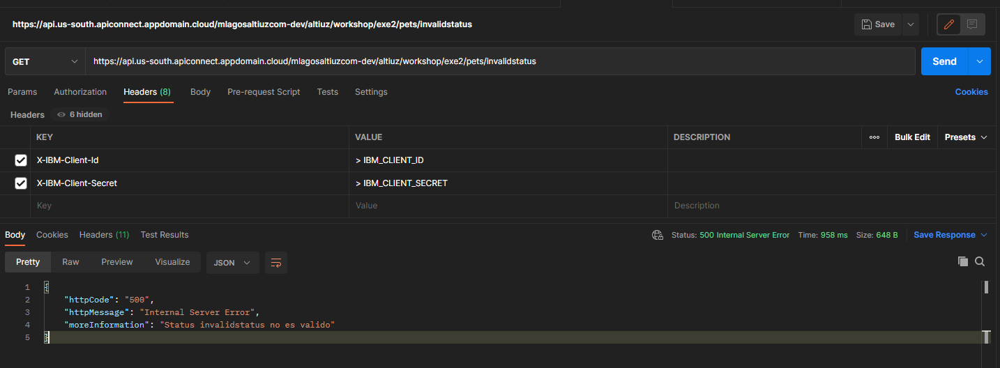

# [[Módulo 4] Ejercicio 2: REST](https://www.ibm.com/docs/en/api-connect/5.0.x?topic=endpoint-tutorial-creating-invoke-rest-api-definition)

## Objetivos

```
> Capturar y filtrar por lista de mascotas el siguiente endpoint: https://petstore.swagger.io/v2/pet/findByStatus?status={status}
> Validación y Control de errores.
> Manjear una respuesta personalizada.
```

## Requerimientos

☐ Consumir Endpoint : https://petstore.swagger.io/v2/pet/findByStatus?status={status} // ["available","pending","sold"]<br/>
☐ Usar Propiedades de URL <br/>
☐ Usar ClientId API Key [ X-IBM-Client-Id ] <br/>
☐ Usar ClientSecret API Key [ X-IBM-Client-Secret ] <br/>
☐ Usar Gatewayscript para validaciones <br/>
☐ URL de exposicion: <br/>
- operation : GET
- basepath: /workshop/exe2
- path: /pets/{status}

## Resultado Esperados

<div align="center"></div> 

## Referencias⚙️
- [Gatewayscript](https://www.ibm.com/docs/es/api-connect/2018.x?topic=gatewayscript-code-examples)
- [Create, deploy and test a new API using the API Connect Developer Toolkit](https://ibm.github.io/cloudpakforintegration-workshop/exercise-api-connect/)
- [Creating Invoke REST API](https://www.ibm.com/docs/en/api-connect/5.0.x?topic=endpoint-tutorial-creating-invoke-rest-api-definition)
- [Pet Store Swagger](https://petstore.swagger.io/#/pet/findPetsByStatus)
