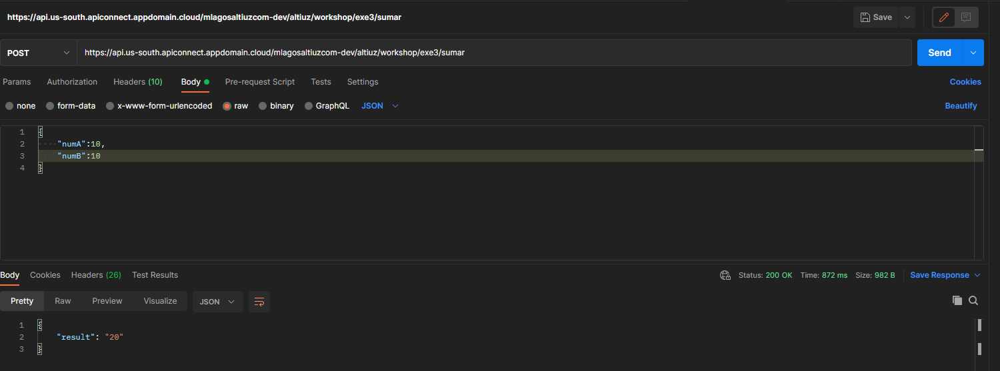
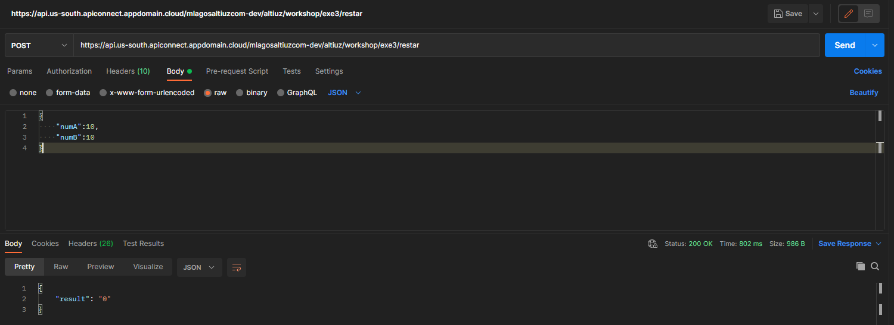
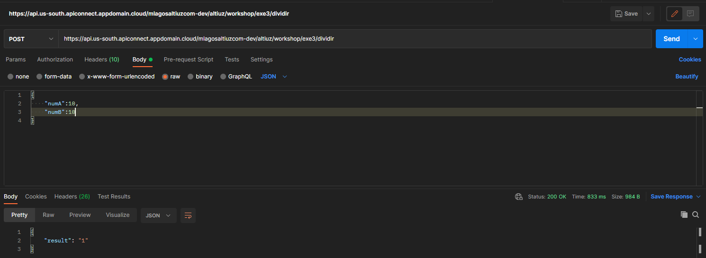
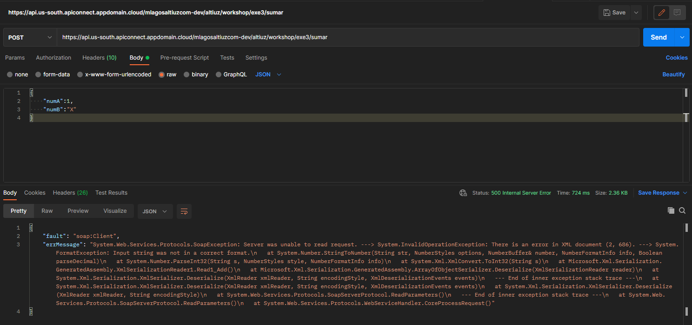

# [[Módulo 5] Ejercicio 1: SOAP](https://www.ibm.com/docs/en/api-connect/5.0.x?topic=endpoint-tutorial-creating-invoke-rest-api-definition)

## Objetivos

```
> Consumir WebService: http://www.dneonline.com/calculator.asmx?WSDL
> Validación y Control de errores.
> Manjear una respuesta en formato JSON.
```

## Requerimientos

☐ Consumir URL Backend : http://www.dneonline.com/calculator.asmx?WSDL <br/>
☐ Usar Propiedades de URL <br/>
☐ Usar ClientId API Key [ X-IBM-Client-Id ] <br/>
☐ Usar ClientSecret API Key [ X-IBM-Client-Secret ] <br/>
☐ URL de exposicion: <br/>
- operation : GET
- basepath: /workshop/exe3
- path: /sumar
- path: /restar
- path: /multiplicar
- path: /dividir
- REQ : {"numA":X,"numB":Y}
- RES : {"result":Z}

## Resultado Esperados

<div align="center"></div> 
<div align="center"></div> 
<div align="center"></div>

## Referencias ⚙️
- [Calcultator WSDL](http://www.dneonline.com/calculator.asmx?WSDL)
- [Create, deploy and test a new API using the API Connect Developer Toolkit](https://ibm.github.io/cloudpakforintegration-workshop/exercise-api-connect/)
- [Creating Invoke REST API](https://www.ibm.com/docs/en/api-connect/5.0.x?topic=endpoint-tutorial-creating-invoke-rest-api-definition)
